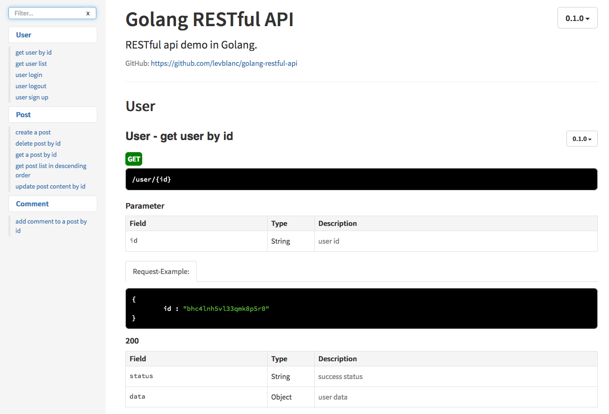
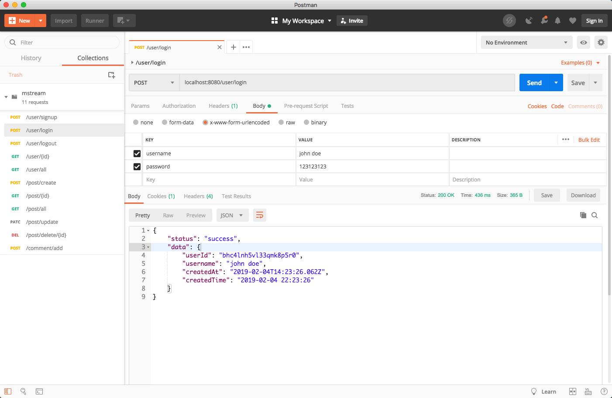

# Golang RESTful Api 

(转到 >> [中文说明](https://github.com/levblanc/golang-restful-api/blob/master/README_zh.md))

This repo is a demo project on building RESTful API of a simple message stream system by using Golang and Mongodb.

Database is hosted on [mLab](https://mlab.com) using a free Sandbox plan which has only 0.5 GB of storage, so this project is for demonstration and testing only. 

(**If my project panics because of database problem, let me know in the issues. Many thantks!**)

Clone this project to your machine and run it through the following instructions. 

[API documentaion](https://github.com/levblanc/golang-restful-api/blob/master/README.md#api-docs) and [postman collection](https://github.com/levblanc/golang-restful-api/blob/master/README.md#make-request-now) are included for your convenience.

## Get Started

I develop this project using the following go version:

```
$ go version
go version go1.11.5 darwin/amd64
```

Compatability with other versions are not tested (Sorry about that), but I think you'll need to upgrade your local go version to at least `v1.11` to get the project running. 

This project uses the following packages:

- [xid](https://github.com/rs/xid): unique id generation
- [gorilla/mux](https://github.com/gorilla/mux): request routing
- [golang/x/crypto/bcrypt](https://godoc.org/golang.org/x/crypto/bcrypt): password hashing
- [mgo](https://github.com/globalsign/mgo): mongodb driver
- [bson](https://godoc.org/github.com/globalsign/mgo/bson): BSON specification

Because the `golang/x/crypto` package is blocked by the GFW in China, I downloaded all of the above packages with the help of `go mod vendor`, and they now lives inside the `src/vendor` directory.

## Run 
```bash
# go to the project directory
$ cd /path/to/golang-restful-api
# run with mod flag
$ go run -mod=vendor src/main.go
2019/02/05 11:16:09 Connected to mongodb database: mstream
2019/02/05 11:16:10 Server started at: http://127.0.0.1:8080
```

## API Docs

API docs are generated using [ApiDoc](http://apidocjs.com).

Open `doc/index.html` in your browser and check it out!



## Routes, Cookie and Session

This project uses cookie for user authorization.

For testing purpose, each user session lasts for **30 mins**.

Here are routes implemented: 

- user: signup, login, logout, get one/all users
- post: CURD
- comment: create

## Make Request Now!

Postman collection `mstream.postman_collection.json` is included under project root.

Import it to your Postman app, and start to make requests!


